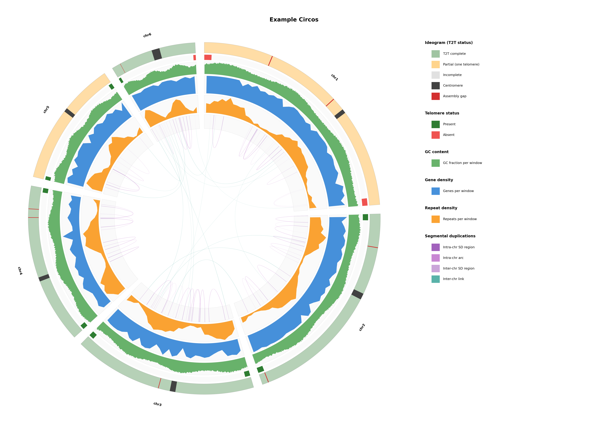

# genome-circos

Publication-quality circular chromosome ideogram with density tracks and segmental duplication links.



## Install

```bash
# with pixi (recommended)
pixi install

# or plain pip
pip install numpy matplotlib pycirclize
```

## Run

Only `--chrom-sizes` is required. Everything else is optional — add tracks as you have them:

```bash
# minimal: just chromosome rings
python plot_circos.py \
  --chrom-sizes genome.fa.fai \
  -o my_genome -t "My Species"

# full: all tracks
python plot_circos.py \
  --chrom-sizes genome.fa.fai \
  --centromere centromeres.bed \
  --gaps gaps.bed \
  --gff genes.gff3 \
  --repeatmasker genome.out \
  --segdups segdups.bedpe \
  --gc gc.bed \
  --t2t t2t_status.tsv \
  --tidk tidk_search.tsv \
  --prefix chr \
  -o my_genome -t "My Species"
```

Outputs `my_genome_circos.png` (300 DPI) and `.pdf`.

## Try the example

```bash
pixi run example
```

This generates synthetic test data for a 6-chromosome genome and plots it.

## Inputs

| Flag | Format | Description |
|------|--------|-------------|
| `--chrom-sizes` | `.fai` or 2-col TSV | Chromosome sizes (required). `cut -f1,2 genome.fa.fai` works. |
| `--centromere` | BED | Centromere regions |
| `--gaps` | BED | Assembly gaps |
| `--gff` | GFF3 | Gene annotation (features with type `gene`) |
| `--repeatmasker` | `.out` | [RepeatMasker](https://www.repeatmasker.org/) output |
| `--segdups` | BED or BEDPE | Segmental duplications. BEDPE auto-detected; filters >90% identity using divergence in col 8 (BISER/SEDEF format). |
| `--gc` | BED | GC content per window (chrom, start, end, gc_fraction) |
| `--t2t` | TSV | T2T assembly status per chromosome (chromosome, status) |
| `--tidk` | TSV | [tidk](https://github.com/tolkit/tidk) search output |

All BED inputs skip `#` comment lines.

## Options

| Flag | Description |
|------|-------------|
| `--prefix` | Only include chromosomes starting with this (e.g. `chr`, `SUPER_`) |
| `--min-size N` | Only include chromosomes >= N bp |
| `-w, --window N` | Density window size in bp (default: 1000000) |
| `-t, --title` | Figure title |
| `-o, --output` | Output file prefix |
| `--no-links` | Suppress inter-chromosomal SD links |
| `--sd-intra` | Show only intra-chromosomal SD arcs |
| `--sd-inter` | Show only inter-chromosomal SD links |
| `--sd-gene-links` | Recolor SD links by gene overlap; saves `{output}_sd_gene_links.tsv` |

## Tracks

From outer to inner ring:
1. **Ideogram** — chromosome bar with centromere fill, gap ticks, T2T status coloring
2. **Telomere status** — green/red bars at chromosome ends
3. **GC content** — green area plot
4. **Gene density** — blue area plot
5. **Repeat density** — orange area plot
6. **SD regions** — purple rectangles + intra/inter-chr link arcs in center

Tracks auto-hide when their input is not provided.

## Citation

If you use this tool in your work, please cite:

> Abuelanin M, Kaya G, Lake JA, Lambert C, Wu MV, Berendzen K, Krasheninnikova K, Wood JMD, Solomon NG, Donaldson ZR, Bales KL, Howe K, Korlach J, Manoli DS, Tollkuhn J, Dennis MY. Single-library chromosome-scale diploid assemblies of vole genomes resolve a species-specific duplication implicated in pair bonding. *bioRxiv* 2026. doi: [10.64898/2026.03.13.711624](https://doi.org/10.64898/2026.03.13.711624)
